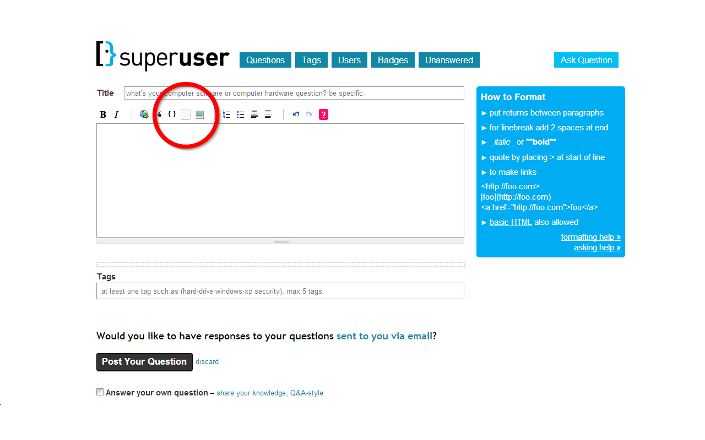

KBD Button for Stack Exchange sites
===================================

Adds a KBD markup button to the editor on StackExchange sites

### Building
To build the extensions yourself, invoke the given `ant` build targets:

- `ant` Build all targets.
- `ant userscript` Build the general-purpose userscript.
- `ant chrome` Build the CRX Chrome extension and the .zip version (for Chrome Web Store upload).
- `ant firefox` Build the XPI Firefox extension.